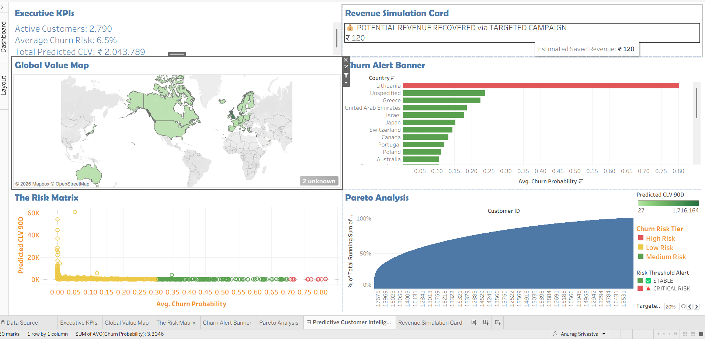

# 📊 E-Commerce Predictive Customer Analytics & Decision Support System

An end-to-end data science project that transforms raw transactional retail data into predictive and prescriptive business insights. This project builds a custom data pipeline utilizing statistical machine learning to forecast **90-Day Customer Lifetime Value (CLV)** and **Churn Probability**, deploying the scored metrics to a live interactive executive dashboard in Tableau.


🚀 **[View Live Interactive Tableau Dashboard](https://public.tableau.com/app/profile/anurag.srivastva/viz/EnterprisePredictiveCustomerAnalyticsIntelligenceHub/PredictiveCustomerIntelligenceHub?publish=yes)**

---

## 🏢 Business Problem & Objective
Acquiring new customers is significantly more expensive than retaining existing ones. This project provides retail marketing teams with an automated decision support platform to:
1. **Identify** high-value customers who are at a critical risk of churning.
2. **Forecast** upcoming financial pipeline revenue over a 90-day horizon.
3. **Simulate** financial returns of targeted retention discount campaigns using prescriptive parameters.

---

## 🛠️ Tech Stack & Architecture
* **Data Layer:** UCI Machine Learning Repository (Online Retail Transaction Dataset)
* **Processing & Modeling:** Python 3.12, Pandas, NumPy, Scikit-Learn
* **Statistical ML Engine:** `lifetimes` (BG/NBD for transaction frequency, Gamma-Gamma for monetary forecasting)
* **Visualization Layer:** Tableau Public Desktop (Decision Support Hub Layout)

---

## 🤖 Data Science & Machine Learning Pipeline

### 1. Data Processing & Cleaning
* Removed cancellations (Invoices beginning with 'C') and adjusted structural pricing anomalies.
* Aggregated invoice data into individual user footprint matrices tracking **Recency, Frequency, and Monetary Value (RFM)**.

### 2. Predictive Modeling 
* **BG/NBD Model:** Trained to calculate the baseline probability of an individual customer being active ("alive") vs. churned, estimating upcoming individual purchase frequencies.
* **Gamma-Gamma Model:** Trained on repeat buyer cohorts to compute individual conditional expected monetary spending per order transaction.
* **CLV Calculation:** Combined models to output an explicit, mathematically sound dollar forecast of each user's financial worth over the next 90 days.

---

## 🖥️ Executive Interactive Dashboard Features

The final Tableau intelligence hub contains a multi-tiered visualization matrix linked with interactive cross-filtering dashboard actions:

* **Executive KPIs Banner:** High-level scorecard highlighting Active Customer Volumes, Average Portfolio Churn Rates, and Total Capital Runway Projections.
* **Prescriptive "What-If" Simulator:** Integrates a responsive slider allowing users to adjust targeted promotional discount parameters to dynamically model expected "Saved Revenue" outcomes.
* **Global Revenue Map:** A filled choropleth world map rendering geographic clusters of incoming cash flow pipelines and alerting managers to critical local risks.
* **Churn Risk Alert Banner:** A country-level risk monitoring strip utilizing conditional threshold logic to automatically flash critical warnings if a specific territory's average churn probability exceeds acceptable baseline operational parameters.
* **Risk Mitigation Scatter Matrix:** Segments all customers into quadrants based on Churn Risk Tiers vs. Predicted CLV to instantly isolate high-priority recovery pools.
* **Pareto Analysis Curve:** An advanced cumulative running total visualization tracking the portfolio's macro value concentration, mathematically proving the asset distribution and isolating top-tier power buyers.

---

## 📁 Repository Structure
```text
├── E_Commerce_Predictive_CLV.ipynb <- Cleanized Python script executing the ML calculations.
├── README.md                       <- This descriptive project portfolio document.
├── dashboard_preview.png           <- This descriptive project portfolio document.
└── predictive_clv_data.csv         <- The final engineered output file loaded into Tableau.
```

---
## 💡 Key Business Insights
* **The 80/20 Rule Proved:** Built-in Pareto Curve calculation indicates that approximately **Top 20% of the active customer base drives over 75%+** of the upcoming 90-day predicted financial runway.

* **Targeted Operations:** Instead of wasting marketing spend blasting a blanket discount across all 2,790+ accounts, teams can filter the dashboard layout to target just the top-right quadrant of the scatter matrix—saving significant margin costs while maximizing conversion recovery.

---
---

## 🚀 Tableau Dashboard Preview

To make your repository pop visually, you should take a screenshot of your finished Tableau dashboard page, name the file `dashboard_preview.png`, and upload it right into your GitHub repository alongside your code. 

You can then embed the image inside your README file using this simple Markdown tag:
```markdown

```
